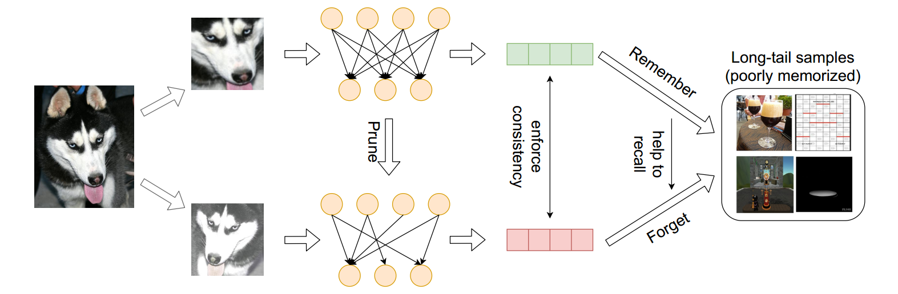

# Self-Damaging Contrastive Learning

## Introduction
The recent breakthrough achieved by contrastive learning accelerates the pace for deploying unsupervised training on real-world data applications. However, unlabeled data in reality is commonly imbalanced and shows a long-tail distribution, and it is unclear how robustly the latest contrastive learning methods could perform in the practical scenario. This paper proposes to explicitly tackle this challenge, via a principled framework called Self-Damaging Contrastive Learning (SDCLR), to automatically balance the representation learning without knowing the classes. Our main inspiration is drawn from the recent finding that  deep models have difficult-to-memorize samples, and those may be exposed through network pruning [1]. It is further natural to hypothesize that long-tail samples are also tougher for the model to learn well due to insufficient examples. 
Hence, the key innovation in SDCLR is to create a dynamic self-competitor model to contrast with the target model, which is a pruned version of the latter. During training, contrasting the two models will lead to adaptive online mining of the most easily forgotten samples for the current target model, and implicitly emphasize them more in the contrastive loss. Extensive experiments across multiple datasets and imbalance settings show that SDCLR significantly improves not only overall accuracies but also balancedness, in terms of linear evaluation on the full-shot and few-shot settings.

[1] Hooker, Sara, et al. "What Do Compressed Deep Neural Networks Forget?." arXiv preprint arXiv:1911.05248 (2019).

## Method

The overview of the proposed SDCLR framework. Built on top of simCLR pipeline
by default, the uniqueness of SDCLR lies in its two different network branches: 
one is the target model to be trained, and the other "self-competitor" model that 
is pruned from the former online. The two branches share weights for their non-pruned
parameters. Either branch has its independent batch normalization layers. 
Since the self-competitor is always obtained and updated from the latest target model,
the two branches will co-evolve during training. Their contrasting will implicitly 
give more weights on long-tail samples.


## Environment
Requirements:
```bash
pytorch 1.7.1 
opencv-python
scikit-learn 
matplotlib
```
Recommend installation cmds (linux)
```bash
conda install pytorch==1.7.1 torchvision==0.8.2 torchaudio==0.7.2 cudatoolkit=10.2 -c pytorch # change cuda version according to hardware
pip install opencv-python
conda install -c conda-forge scikit-learn matplotlib
```

## Details about and Imagenet-100-LT Imagenet-LT-exp
[Imagenet-100-LT sampling list](split/imagenet-100/imageNet_100_LT_train.txt)

[Imagenet-LT-exp sampling list](split/ImageNet_LT/imageNet_LT_exp_train.txt)

## Pretrained models downloading
CIFAR10: [pretraining](https://drive.google.com/file/d/1zsm6hd7Hx_JOPERG6pChe5xnSAXViLOT/view?usp=sharing), [fine-tuning](https://drive.google.com/file/d/1FV-_KFMy2LBqw46UcfxqkAvxIADQVnKt/view?usp=sharing)

CIFAR100: [pretraining](https://drive.google.com/file/d/1e2GvLQCNooLUpf72lIOFkMvntXWQUMHg/view?usp=sharing), [fine-tuning](https://drive.google.com/file/d/1x-ZJGgNT-Cs0O1DUkPyndwXn5KOGa8sc/view?usp=sharing)

Imagenet100/Imagenet: [pretraining](https://drive.google.com/file/d/1LSvWHl0Qa_072c0EUddm4mg9ZykrVLFb/view?usp=sharing), [fine-tuning](https://drive.google.com/file/d/1yOGSrJpab3xZHnKPS6QYKwow5nmU8BrR/view?usp=sharing)

## Train and evaluate pretrained models
### Before all
```bash
chmod +x  cmds/shell_scrips/*
```
### CIFAR10
SimCLR on balanced training datasets
```
# pre-train and finetune
for split_num in 1 2 3 4 5
do
./cmds/shell_scrips/cifar-10-LT.sh -g 1 -w 8 --split split${split_num}_D_b
done

# evaluate pretrained model (after download and unzip the pretrained model)
for split_num in 1 2 3 4 5
do
./cmds/shell_scrips/cifar-10-LT.sh -g 1 -w 8 --split split${split_num}_D_b  --only_finetuning True  --test_only True
done

# summery result (after "pre-train and finetune" or "evaluate pretrained model")
# linear separability
python exp_analyse.py --dataset cifar10
# few shot
python exp_analyse.py --dataset cifar10 --fewShot
```
SimCLR on long tail training datasets
```
# pre-train and finetune
for split_num in 1 2 3 4 5
do
./cmds/shell_scrips/cifar-10-LT.sh -g 1 -w 8 --split split${split_num}_D_i
done

# evaluate pretrained model (after download and unzip the pretrained model)
for split_num in 1 2 3 4 5 
do
./cmds/shell_scrips/cifar-10-LT.sh -g 1 -w 8 --split split${split_num}_D_i --only_finetuning True --test_only True
done

# summery result (after "pre-train and finetune" or "evaluate pretrained model")
# linear separability
python exp_analyse.py --dataset cifar10 --LT
# few shot
python exp_analyse.py --dataset cifar10 --LT --fewShot
```

SDCLR on long tail training datasets
```
# pre-train and finetune
for split_num in 1 2 3 4 5
do
./cmds/shell_scrips/cifar-10-LT.sh -g 1 -w 8 --split split${split_num}_D_i --prune True --prune_percent 0.9 --prune_dual_bn True
done

# evaluate pretrained model (after download and unzip the pretrained model)
for split_num in 1 2 3 4 5 
do
./cmds/shell_scrips/cifar-10-LT.sh -g 1 -w 8 --split split${split_num}_D_i --prune True --prune_percent 0.9 --prune_dual_bn True --only_finetuning True --test_only True
done

# summery result (after "pre-train and finetune" or "evaluate pretrained model")
# linear separability
python exp_analyse.py --dataset cifar10 --LT --prune
# few shot
python exp_analyse.py --dataset cifar10 --LT --prune --fewShot
```
### CIFAR100
SimCLR on balanced training datasets
```
# pre-train and finetune
for split_num in 1 2 3 4 5
do
./cmds/shell_scrips/cifar-100-LT.sh -g 1 -p 4867 -w 8 --split cifar100_split${split_num}_D_b
done

# evaluate pretrained model (after download and unzip the pretrained model)
for split_num in 1 2 3 4 5
do
./cmds/shell_scrips/cifar-100-LT.sh -g 1 -p 4867 -w 8 --split cifar100_split${split_num}_D_b --only_finetuning True --test_only True
done

# summery result (after "pre-train and finetune" or "evaluate pretrained model")
# linear separability
python exp_analyse.py --dataset cifar100
# few shot
python exp_analyse.py --dataset cifar100 --fewShot
```

SimCLR on long tail training datasets
```
# pre-train and finetune
for split_num in 1 2 3 4 5
do
./cmds/shell_scrips/cifar-100-LT.sh -g 1 -p 4867 -w 8 --split cifar100_split${split_num}_D_i
done

# evaluate pretrained model (after download and unzip the pretrained model)
for split_num in 1 2 3 4 5
do
./cmds/shell_scrips/cifar-100-LT.sh -g 1 -p 4867 -w 8 --split cifar100_split${split_num}_D_i --only_finetuning True --test_only True
done

# summery result (after "pre-train and finetune" or "evaluate pretrained model")
# linear separability
python exp_analyse.py --dataset cifar100 --LT
# few shot
python exp_analyse.py --dataset cifar100 --LT --fewShot
```

SDCLR on long tail training datasets
```
# pre-train and finetune
for split_num in 1 2 3 4 5
do
./cmds/shell_scrips/cifar-100-LT.sh -g 1 -p 4867 -w 8 --split cifar100_split${split_num}_D_i --prune True --prune_percent 0.9 --prune_dual_bn True
done

# evaluate pretrained model (after download and unzip the pretrained model)
for split_num in 1 2 3 4 5
do
./cmds/shell_scrips/cifar-100-LT.sh -g 1 -p 4867 -w 8 --split cifar100_split${split_num}_D_i --prune True --prune_percent 0.9 --prune_dual_bn True --only_finetuning True --test_only True
done

# summery result (after "pre-train and finetune" or "evaluate pretrained model")
# linear separability
python exp_analyse.py --dataset cifar100 --LT --prune
# few shot
python exp_analyse.py --dataset cifar100 --LT --prune --fewShot
```
### Imagenet-100-LT
SimCLR on balanced training datasets
```
# pre-train and finetune
./cmds/shell_scrips/imagenet-100-res50-LT.sh --data \path\to\imagenet -g 2 -p 4867 -w 10 --split imageNet_100_BL_train

# evaluate pretrained model (after download and unzip the pretrained model)
./cmds/shell_scrips/imagenet-100-res50-LT.sh --data \path\to\imagenet -g 2 -p 4867 -w 10 --split imageNet_100_BL_train --only_finetuning True --test_only True

# summery result (after "pre-train and finetune" or "evaluate pretrained model")
# linear separability
python exp_analyse.py --dataset imagenet100
# few shot
python exp_analyse.py --dataset imagenet100 --fewShot
```
SimCLR on long tail training datasets
```
# pre-train and finetune
./cmds/shell_scrips/imagenet-100-res50-LT.sh --data \path\to\imagenet -g 2 -p 4867 -w 10 --split imageNet_100_LT_train

# evaluate pretrained model (after download and unzip the pretrained model)
./cmds/shell_scrips/imagenet-100-res50-LT.sh --data \path\to\imagenet -g 2 -p 4860 -w 10 --split imageNet_100_LT_train --only_finetuning True --test_only True

# summery result (after "pre-train and finetune" or "evaluate pretrained model")
# linear separability
python exp_analyse.py --dataset imagenet100 --LT
# few shot
python exp_analyse.py --dataset imagenet100 --LT --fewShot
```
SDCLR on long tail training datasets
```
# pre-train and finetune
./cmds/shell_scrips/imagenet-100-res50-LT.sh --data \path\to\imagenet -g 2 -p 4867 -w 10 --split imageNet_100_LT_train --prune True --prune_percent 0.3 --prune_dual_bn True --temp 0.3

# evaluate pretrained model (after download and unzip the pretrained model)
./cmds/shell_scrips/imagenet-100-res50-LT.sh --data \path\to\imagenet -g 2 -p 4860 -w 10 --split imageNet_100_LT_train --prune True --prune_percent 0.3 --prune_dual_bn True --temp 0.3 --only_finetuning True --test_only True

# summery result (after "pre-train and finetune" or "evaluate pretrained model")
# linear separability
python exp_analyse.py --dataset imagenet100 --LT --prune
# few shot
python exp_analyse.py --dataset imagenet100 --LT --prune --fewShot
```
### Imagenet-Exp-LT
SimCLR on balanced training datasets
```
# pre-train and finetune
./cmds/shell_scrips/imagenet-res50-LT.sh --data \path\to\imagenet -g 2 -p 4867 -w 10 --split imageNet_BL_exp_train

# evaluate pretrained model (after download and unzip the pretrained model)
./cmds/shell_scrips/imagenet-res50-LT.sh --data \path\to\imagenet -g 2 -p 4867 -w 10 --split imageNet_BL_exp_train --only_finetuning True --test_only True

# summery result (after "pre-train and finetune" or "evaluate pretrained model")
# linear separability
python exp_analyse.py --dataset imagenet
# few shot
python exp_analyse.py --dataset imagenet --fewShot
```
SimCLR on long tail training datasets
```
# pre-train and finetune
./cmds/shell_scrips/imagenet-res50-LT.sh --data \path\to\imagenet -g 2 -p 4867 -w 10 --split imageNet_LT_exp_train

# evaluate pretrained model (after download and unzip the pretrained model)
./cmds/shell_scrips/imagenet-res50-LT.sh --data \path\to\imagenet -g 2 -p 4868 -w 10 --split imageNet_LT_exp_train --only_finetuning True --test_only True

# summery result (after "pre-train and finetune" or "evaluate pretrained model")
# linear separability
python exp_analyse.py --dataset imagenet --LT
# few shot
python exp_analyse.py --dataset imagenet --LT --fewShot
```

## Citation
```bash
@inproceedings{
jiang2021self,
title={Self-Damaging Contrastive Learning},
author={Jiang, Ziyu and Chen, Tianlong and Mortazavi, Bobak and Wang, Zhangyang},
booktitle={International Conference on Machine Learning},
year={2021}
}
```